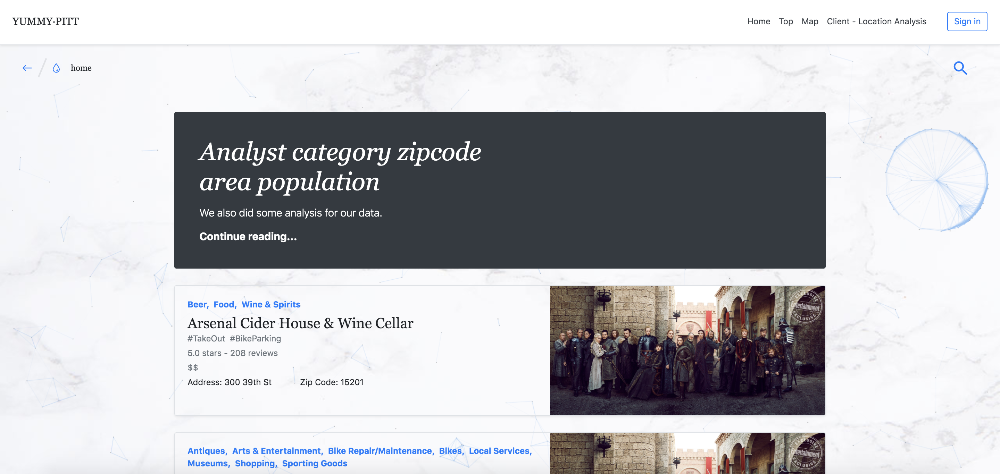
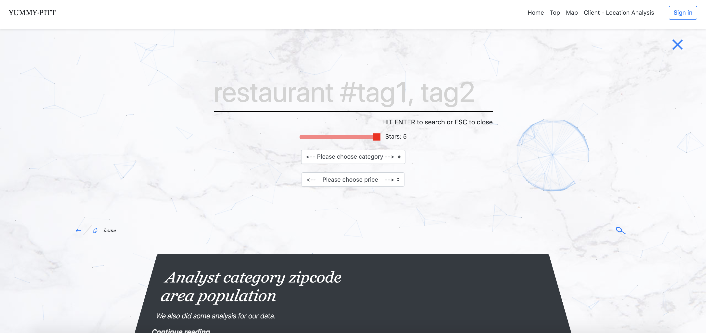
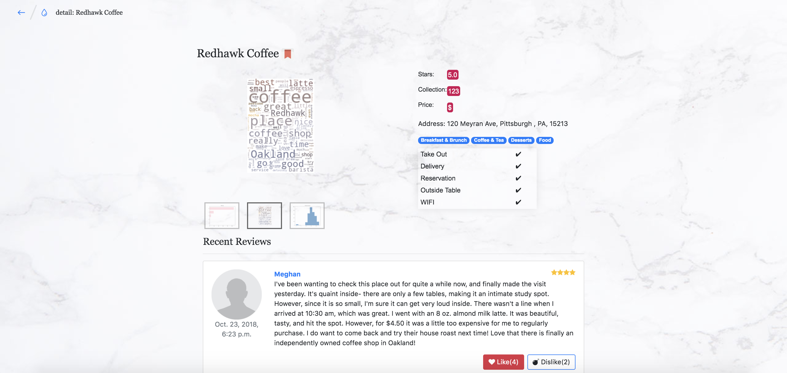
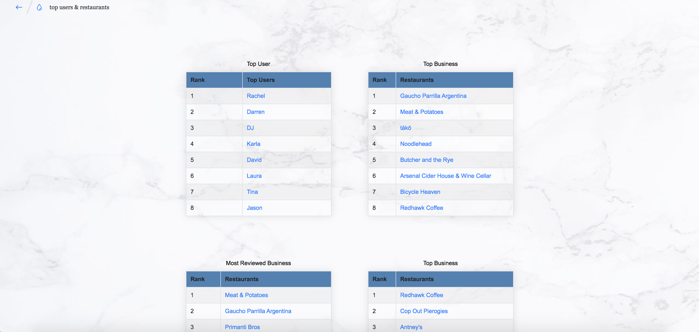
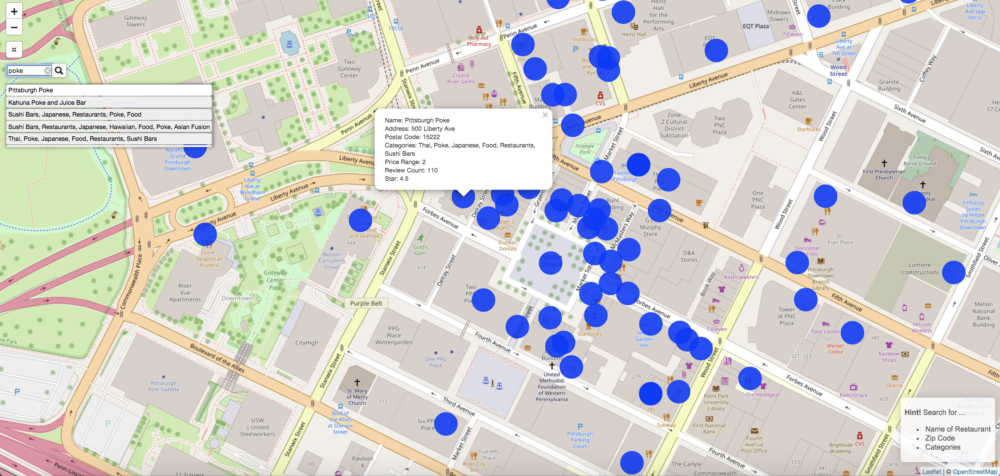
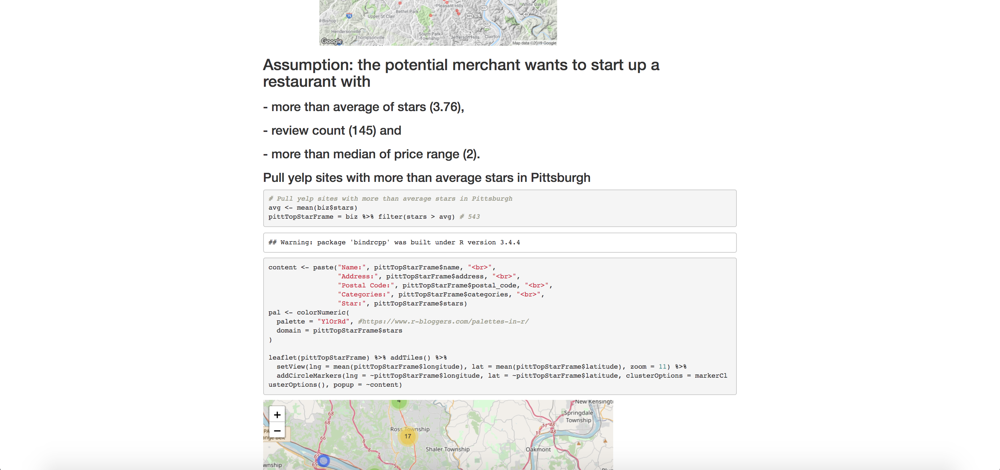

# YUMMY·PITT

**YUMMY·PITT** is a searching platform focusing on local restaurants in Pittsburgh based on crowd-sourced reviews from Yelp.com.

## Team

- Zechen Wang
- Zhiming Yang
- Weihan Chen
- Tianlin Zhao
- Lorraine Wei
- Chao Guo
- Zonghan Zhang
- Yue Huang
- Xiaofan Xu

## Timeline

- Start Date: 2019/03/09
- Last Update: 2019/04/16

## Demo

Homepage

Searchbar

Detail Page

Top Eats

Map

Analytics & Visualization

